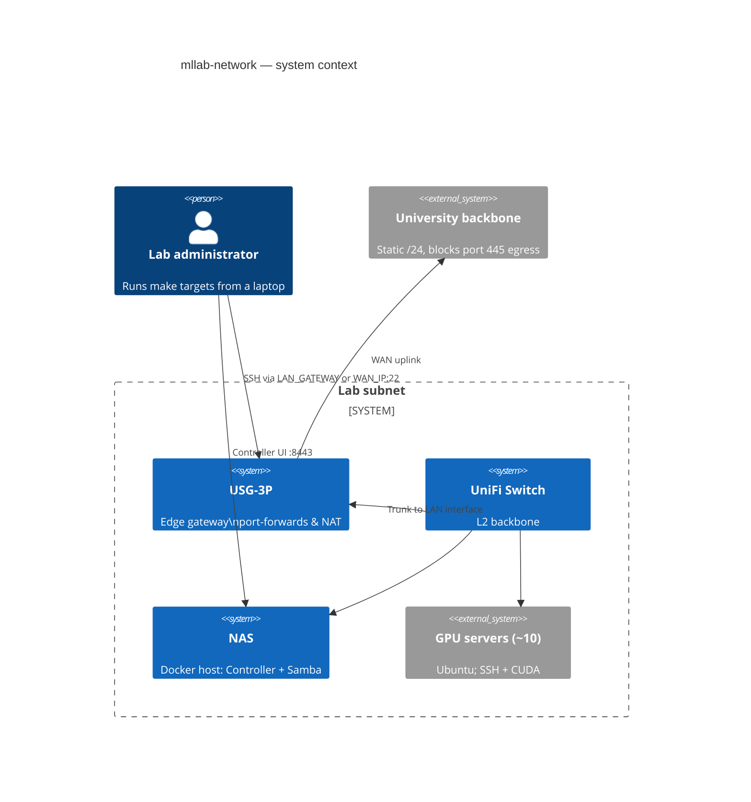
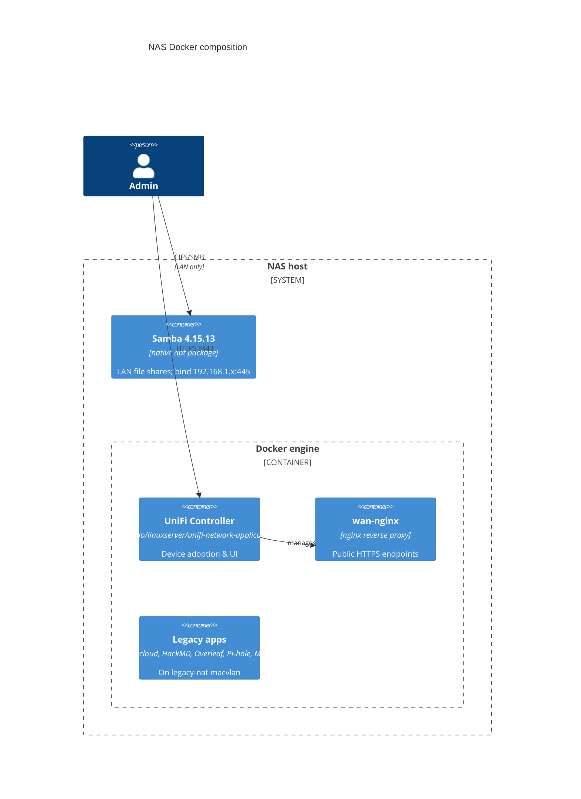
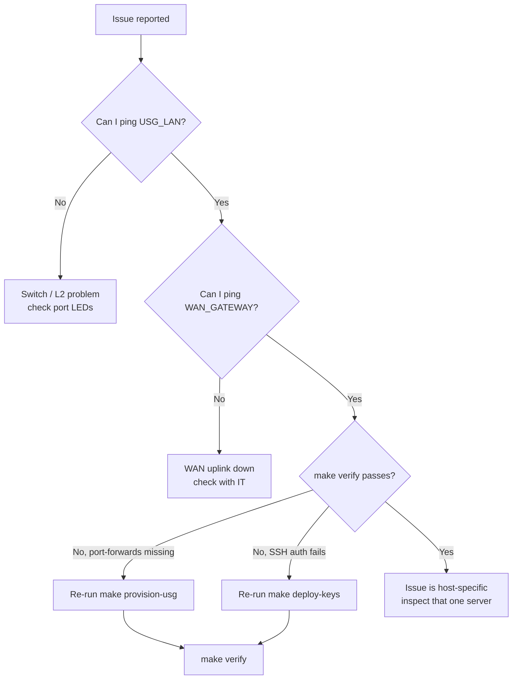

# Architecture — C4 Mermaid views

GitHub renders these natively. Re-render offline with `mmdc`.

---

## C4 — System Context



---

## C4 — Container view (NAS)



---

## Flow — `make provision`

```mermaid
sequenceDiagram
    actor Admin
    participant Makefile
    participant usg.py
    participant USG as USG (EdgeOS)
    participant controller.py
    participant Controller as UniFi Controller

    Admin->>Makefile: make provision
    Makefile->>usg.py: python -m mllab_net.usg
    usg.py->>USG: SSH mllab@LAN_GATEWAY
    usg.py->>USG: configure; set WAN static
    usg.py->>USG: delete port-forward
    loop each rule from inventory
        usg.py->>USG: set port-forward rule N ...
    end
    usg.py->>USG: commit; save
    USG-->>usg.py: committed
    Makefile->>controller.py: python -m mllab_net.controller
    controller.py->>Controller: POST /api/login
    controller.py->>Controller: DELETE all /rest/portforward
    loop each rule
        controller.py->>Controller: POST /rest/portforward
    end
    controller.py->>Controller: PUT /rest/networkconf WAN=static
    controller.py->>USG: mca-cli-op set-inform http://NAS:8080/inform
    Controller-->>Admin: USG adopted, rules live
```

---

## Decision tree — "the network is broken"


